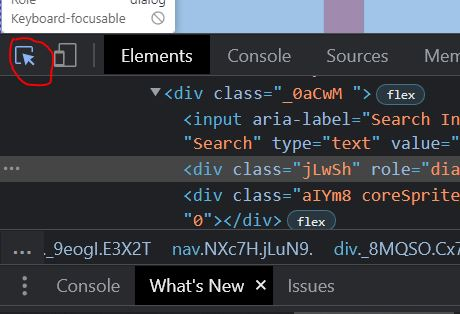
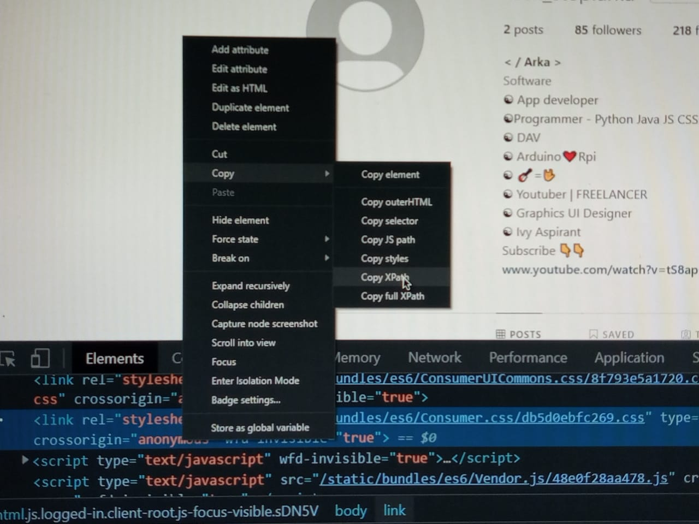
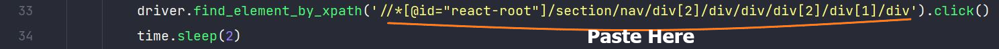

# **InstaComment** - A ``Python Module`` by ``Arka Saha``
This Module Helps Users To Post Custom Comments On Instagram Posts Of A Particular Account

 

## Current Features
<ul>
  <li>Automate Commenting on Instagram Posts</li>
 
</ul>

 

## Handling Errors (Eg, Element Not Found, or Not Interactable)
`1. Open The Inspect Tab > Click On The Selector Tool and Select the Malfunctioning Element or Item from The WebPage.`
  
  <tab><tab>
    
`2. Copy The Xpath Of The Element by, right clicking on the element in inspect tab > Copy > Copy Xpath` 
    
  <tab><tab>
      
`3. Paste The Copied Xpath in the line which threw the error! Like, In this image, if error was in line 33, the xpath would have been pasted there.`
       
    <tab><tab>
